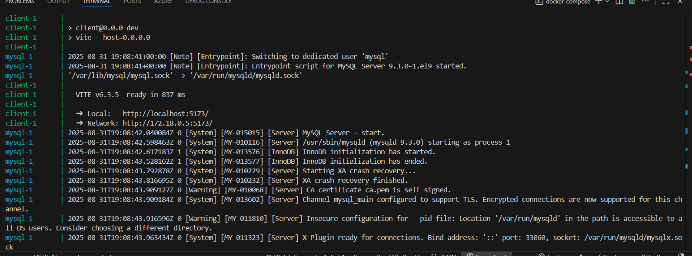
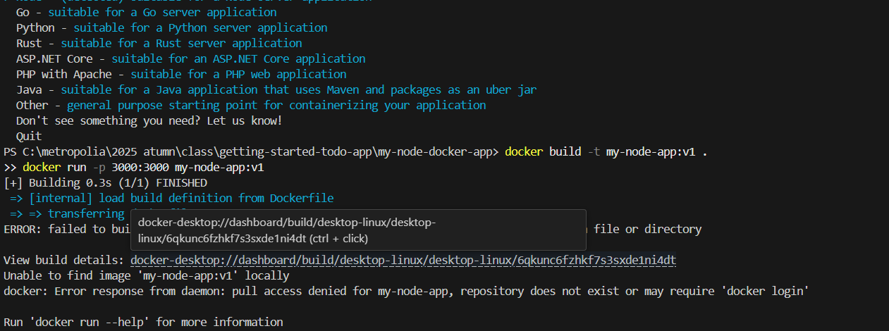
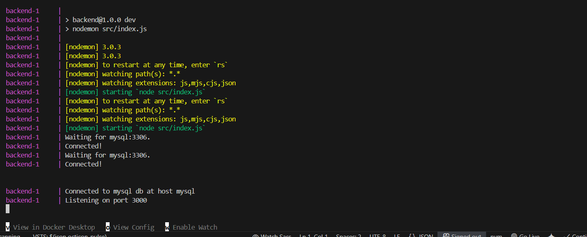
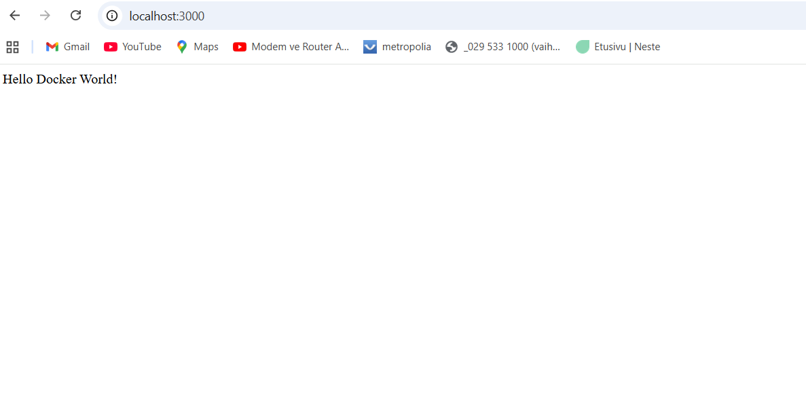
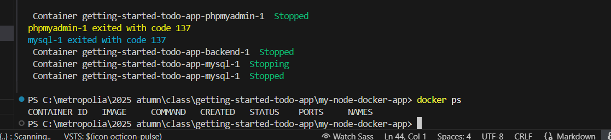

# Docker Tutorial Steps

# Cloned the todo app:

git clone https://github.com/docker/getting-started-todo-app.git
cd getting-started-todo-app

# Installed dependencies:

cd backend
npm install
cd ../client
npm install
cd ..

# Ran the app with Docker Compose:

docker-compose up --watch

# Checked the app:
Frontend: http://localhost

# Build and Run Production Image
docker build -t my-node-app:v1 .
 

# Ran locally:

npm run dev
  

 # Ran with Docker Compose:

docker-compose up --watch

#
 
  

